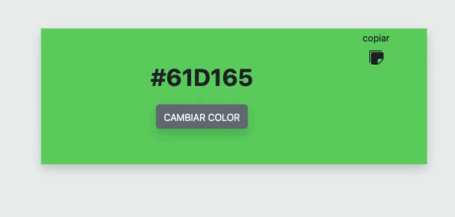

# Color Flipper

## Tabla de Contenido.
1. [Descripción](#descripción)
2. [Stack](#Stack)
3. [Instalación](#Instalación)
4. [Proyecto] (#Proyecto)

### 📝 Descripción
Desafío Nuwe Front-end Color Flipper.
Generador de colores aleatorios con posibilidad de copiar el código en el portapapeles

### 💻 Stack

FRONT-END

 

<a href="https://developer.mozilla.org/en-US/docs/Web/JavaScript" target="_blank"> 

### 💾 Instalación:
1. Arranca el proyecto con `$ npm run dev`
2. Instalar los paquetes: `$ npm install`
Paquetes utilizados:
React Icons
React Copy-to-clipboard
Tailwinds CSS

### 🚀 Proyecto desplegado :

